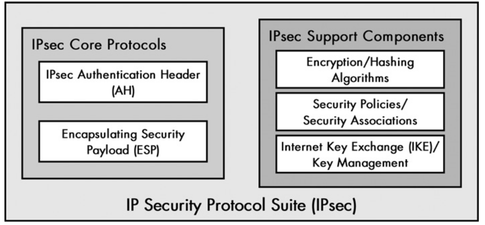

# IP Security Protocols (IPsec)

Security is already commonly applied at application layer protocols through the use of SSL/TLS. IPsec relates to security protocols designed to work at the network layer. Why? An extra layer of security is important, and because many application protocols where not designed to work with SSL/TLS in the first place.

## IPsec services and functions

IPsec is not a single protocol but a set of protocols and services that provide security at the netwrok level.

- Encryption of user data.
- Two security modes: transport and tunnel.
- Authentication of the integrity of messages to ensure they are not changed while hoping through routers.
- Ability for devices to negotiate security algorithms and keys.
- Protection against certain types of attacks such as replay attacks.

## IPsec Standards

As said, IPsec is a collection of protocols and standards. Here are the important related RFC's.

| RFC number | Name                          | Description                                     |
|------------|-------------------------------|-------------------------------------------------|
| 2401 | Security for The Internet Protocol | Describes the general architecture for implementing IPsec and how different components fit together.  |
| 2402 | IP Authentication Header Protocol (AH) | Describes the AH protocol which ensures data integrity and origin verification.  |
| 2406 | IP Encapsulating Security Payload (ESP)  | Provides encryption of the payload  |
| 2408 | Internet Security Association and Key Management Protocol (ISAKMP)  | Defines methods for exchanging keys and negotiating security associations.  |
| 2409 | The Internet Key Exchange (IKE)  | Describes the IKE protocol which is based on ISAKMP and OAKLEY and used to exchanged keys and security associations.  |
| 2412 | The OAKLEY Key Determination Protocol  | Generic key exchanging protocol.  |

## IPsec General Operation

The image bellow represents the IPsec protocol suite.

### IPsec Authentication Header (AH)

- Provides authentication services for IP, i.e, ensures that the sender is really who he says he is.

- Ensures the integrity of the IP datagram, i.e, intermediate routers don't change it.

- Protects against replay attacks: a message is captured and resent by an unauthorized user.

### Encapsulating Security Payload (ESP)

- It encrypts the payload of the IP datagram.

### IPsec Support Components

In order to function properly IPsec needs more than the core protocols:

- Encryption and Hashing algorithms need to be defined between the hosts that want to exchange information.

- Because IPsec is flexible in the way the security is implemented, Security Policies and Security Associations must be defined aswell.

- Means for exchanging the keys used for decrypting, this is provided by IKE.

*Security policy* : Defines which traffic in the network should be protected using IPsec features. In general, it's a rule that says what should be protected. For example, all subnets and hosts of 10.0.0.0/26.

*Security association* : An agreement between the devices that tells exactly how they should protect the traffic, example: use the Arg2 algorithm for integrity (hashing) and RSA for encryption; lifetime of keys; mode of operation (tunnel or transport); sequence numbers to protect against replay attacks; etc. 
