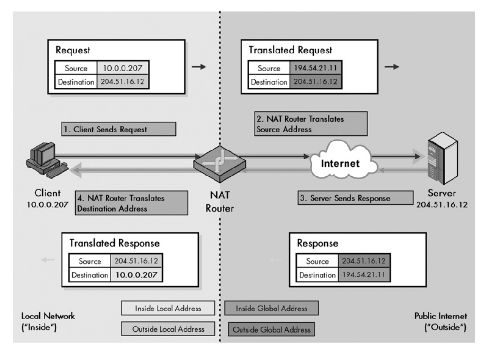
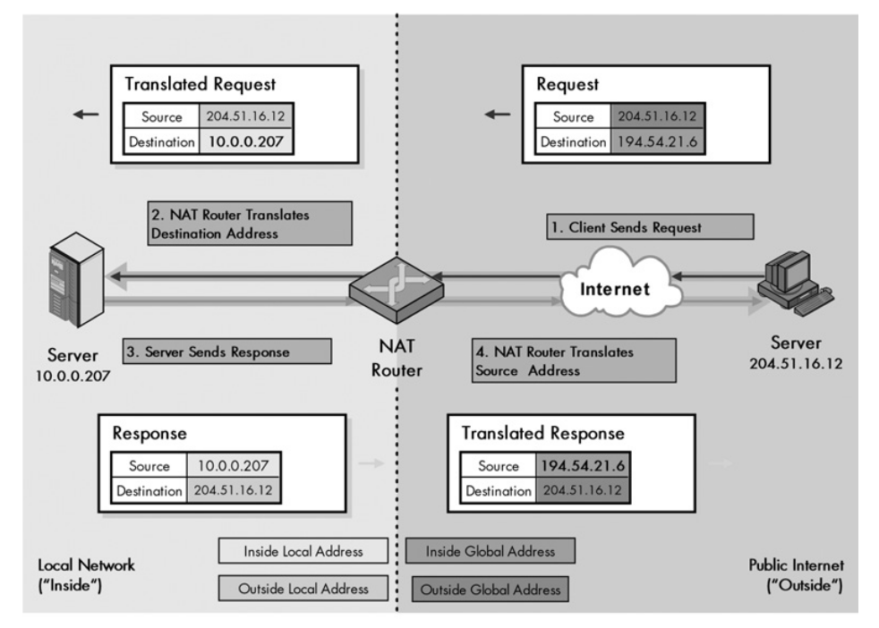
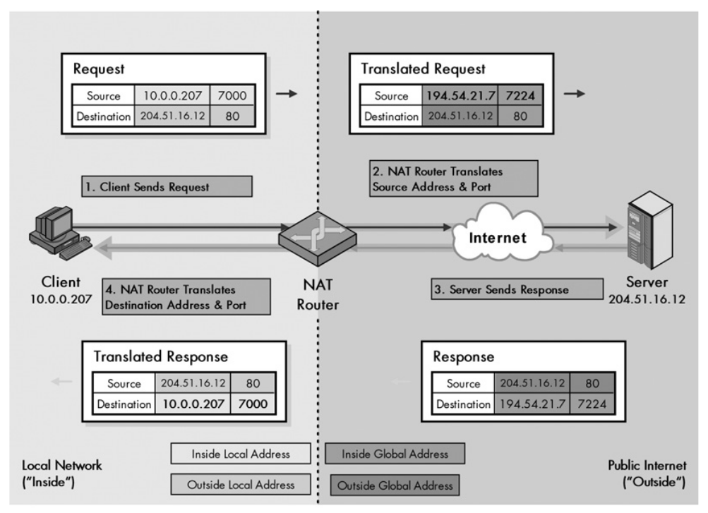

# Network Address Translation (NAT)

Provides translation of public IP addresses into private IP addresses for a LAN and vice-versa. A router must be capable of performing NAT functions: It needs a NAT translation table.

*Inside address* : Refers to any address on the LAN.

*Outside address* : Refers to any address outside the LAN, in the Internet.

*Local address* : Refers to an address that appears in datagram in  the LAN: it may be an inside or outside one.

*Global address* : Refers to an address that appears in a datagram on the Internet: it may be an inside or outside one.

Eg. A host on a LAN performs an HTTP request to a server.

- Host on a LAN: has an inside local address 10.0.0.2
- The router of the LAN: has an inside local address 10.0.0.1 and inside global address 78.54.2.85
- The HTTP server has outside global address 19.24.250.3
- The HTTP server has a local global address that corresponds to the outside global address in most cases.

## Address mappings

*Static mapping* : Maps an inside local address to an inside global address.

*Dynamic mapping* : Maps inside local addresses to a pool of inside global addresses.

## Types of NAT

### Unidirectional NAT (aka traditional/outbound NAT)

Only operates on outbound transactions, that is, requests from hosts on the LAN to the Internet.

A request source inside local address is changed by the NAT router to the inside global address. The router saves the mapping on a table. When it receives the reply it checks the mapping and changes the destination address from inside global to inside local.
In the example bellow dynamic mapping is used but could also be applied static mapping since there is only one router.

NOTE: The header checksums for IP and the transport layer protocol (TCP or UDP) must be recalculated.

NOTE: If multiple routers are used the must coordinate their address mappings (this makes dynamic mapping extremely difficult).

### Bidirectional NAT (aka two-way/inbound NAT)

Exact same as unidirectional NAT except requests can be generated from the outside.

### Port-based (overloaded) NAT

In port-based NAT several hosts usually share one public address. The router differentiates the requests and makes the correct translations based on a combination of the IP address and an associated port number.

In the image bellow the routes sees the source address and port 10.0.0.207:7000, since this port is already in use it associates the port 7224 to the request and saves the mapping in a table. Once the response comes back it sees the destination has the port number 7224 so it knows that it must go to 10.0.0.2007 at port 7000

## NAT related issues

NAT must recalculate not only the IP header checksum but also the underlying transport layer header checksum, wether TCP or UDP.

Sometimes the translated address by NAT requires more ASCII characters (eg. 10.0.0.207 is 10 ASCII and 194.54.21.11 is 12 ASCII characters long). This means that the length of the IP datagram changes and, has a consequence, if TCP is involved the sequence numbers must also be recalculated. NAT is expected to deal with all this. 

IP works very closely with ICMP, NAT must also change some addresses contained in ICMP messages.

Some Application level protocols include IP addresses as part of the payload and thus NAT must also be configured to deal with those addresses. FTP is the most notorious case, and the complexity rises exponentially if the IP datagrams are fragemented.

NAT can't be used with IPsec in transport mode, it may only be used with IPsec in tunnel mode but there are also complications here. 
